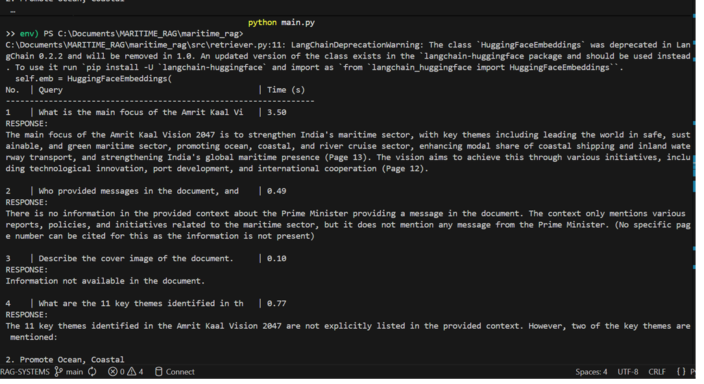
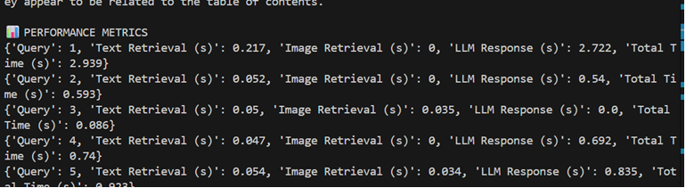

## Evaluation and Deliverables

### 2.	Screenshots of the RAG system's responses to the 5 sample queries below.

image 



```bash
 | Time (s)  
-----------------------------------------------------------------
1    | What is the main focus of the Amrit Kaal Vi   | 2.77      
RESPONSE:
The main focus of the Amrit Kaal Vision 2047 is to strengthen India's maritime sector, with key themes including leading the world in safe, sustainable, and green maritime sector, promoting ocean, coastal, and river cruise sector, enhancing modal share of coastal shipping and inland waterway transport, and strengthening India's global maritime presence (Page 13). The vision aims to achieve this through various initiatives, including technological innovation, port development, and international cooperation (Page 12).

2    | Who provided messages in the document, and    | 0.82      
RESPONSE:
There is no information in the provided context about the Prime Minister providing a message in the document. The context only mentions various reports, policies, and initiatives related to the maritime sector, but it does not mention any message from the Prime Minister. (No specific page number can be cited for this as the information is not present)

3    | Describe the cover image of the document.     | 0.11      
RESPONSE:
Information not available in the document.

4    | What are the 11 key themes identified in th   | 1.01
RESPONSE:
The 11 key themes identified in the Amrit Kaal Vision 2047 are not explicitly listed in the provided context. However, two of the key themes are mentioned:

1. Lead The World In Safe, Sustainable & Green Maritime Sector
2. Promote Ocean, Coastal

The context only provides a partial list of the key themes, and the complete list of 11 key themes is not available in the given text. (Page 9)

5    | What visual elements are in the Executive S   | 1.02      
RESPONSE:
On page 8, there are two visual elements: img_8_1.png and img_8_2.png, which appear to be table contents for the table of contents (page 8). However, the Executive Summary itself starts on page 9, and there is no information provided about the visual elements on page 9. Therefore, it is unclear what visual elements are present in the Executive Summary.

(.venv) PS C:\Documents\MARITIME_RAG\maritime_rag> 
```

### 3.	A table summarizing the performance metrics.


| Query No. | Text Retrieval Time (s) | Image Retrieval Time (s) | LLM Response Time (s) | Total Response Time (s) |
|----------|-------------------------|--------------------------|-----------------------|-------------------------|
| 1 | 0.217 | 0.000 | 2.722 | 2.939 |
| 2 | 0.052 | 0.000 | 0.540 | 0.593 |
| 3 | 0.050 | 0.035 | 0.000 | 0.086 |
| 4 | 0.047 | 0.000 | 0.692 | 0.740 |
| 5 | 0.054 | 0.034 | 0.835 | 0.923 |





### 4.	Evaluate the multi modal rag application with the standard metrics.
